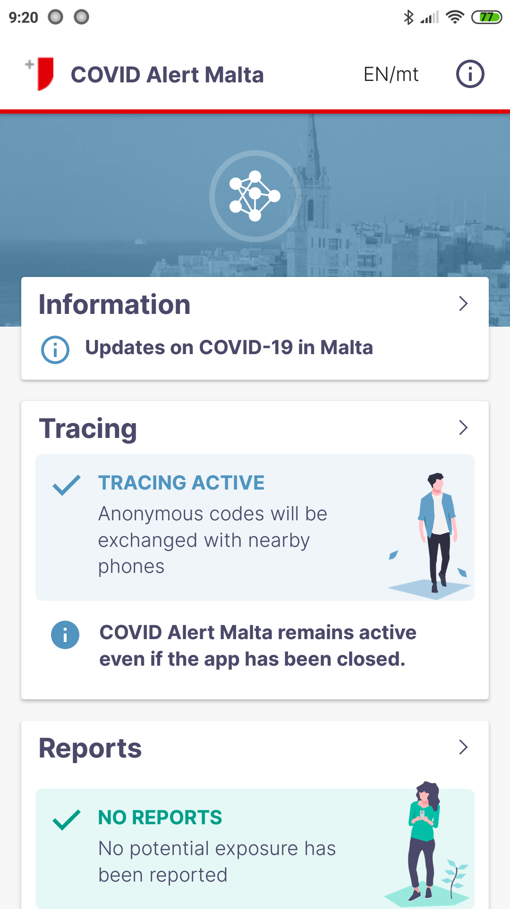
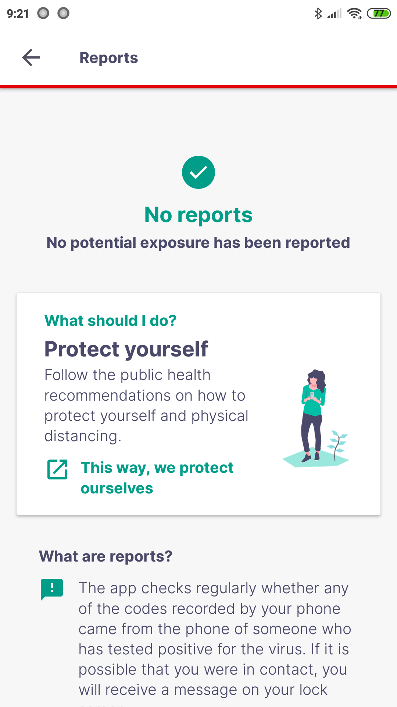
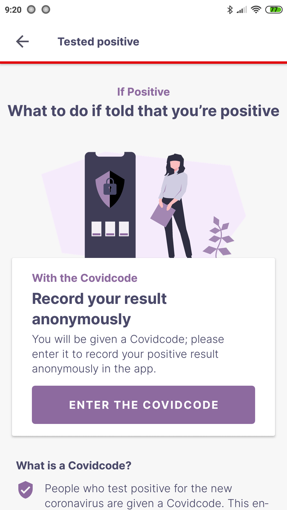
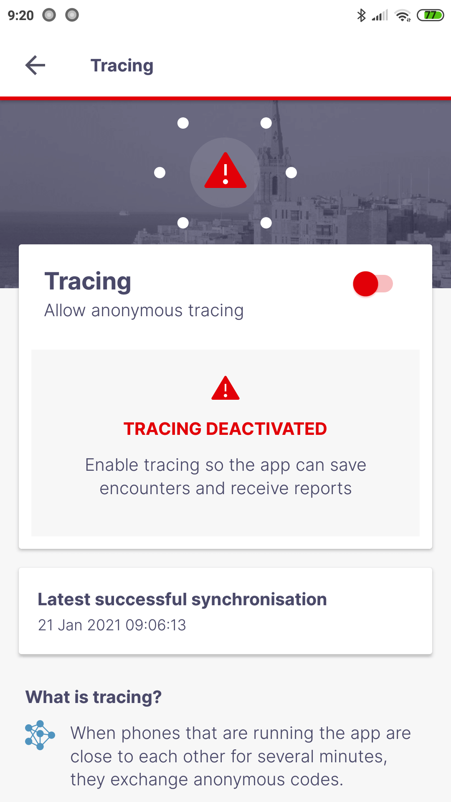
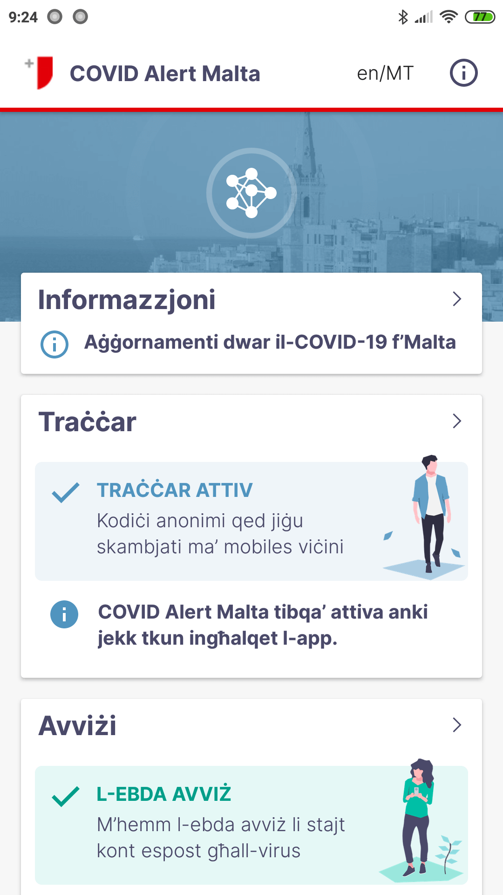
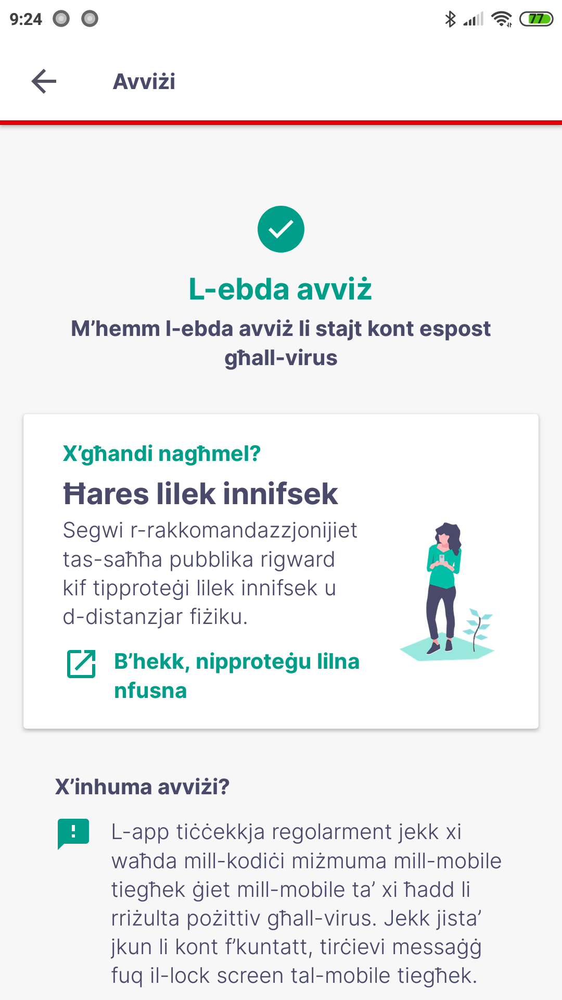
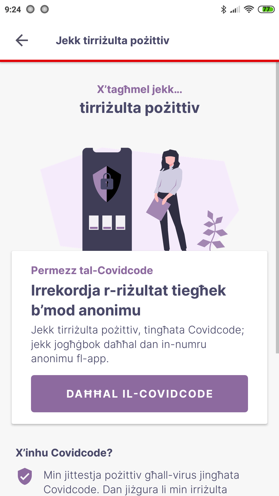
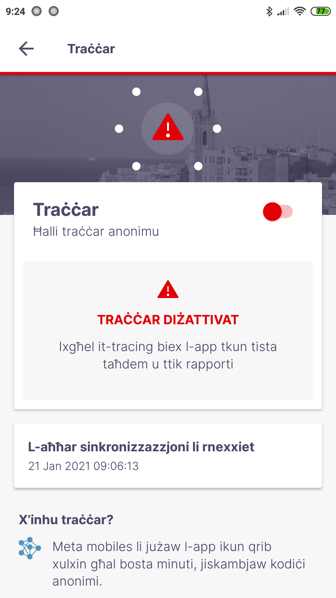

# CovidAlertMT: DP3T Android App for Malta

## DP3T
The Decentralised Privacy-Preserving Proximity Tracing (DP-3T) project is an open protocol for COVID-19 proximity tracing using Bluetooth Low Energy functionality on mobile devices that ensures personal data and computation stays entirely on an individual's phone. It was produced by a core team of over 25 scientists and academic researchers from across Europe. It has also been scrutinized and improved by the wider community.

DP-3T is a free-standing effort started at EPFL and ETHZ that produced this protocol and that is implementing it in an open-sourced app and server.

## Introduction
CovidAlertMT is a COVID-19 tracing client based on the official COVID-19 tracing solution for Switzerland, with changes and optimisations to accommodate Maltese requirements.

English

Maltese

## Contribution Guide
This project is open-source and we welcome any feedback on the code regarding both the implementation and security aspects.

Bugs or potential problems should be reported using Github issues. Pull requests that improve the quality of the source code are welcomed. 

## Repositories
* Android SDK & Calibration app: [dp3t-sdk-android](https://github.com/DP-3T/dp3t-sdk-android)
* iOS SDK & Calibration app: [dp3t-sdk-ios](https://github.com/DP-3T/dp3t-sdk-ios)
* Android App: [dp3t-app-android](https://github.com/GOVMT-MITA/dp3t-app-android-mt)
* iOS App: [dp3t-app-ios](https://github.com/GOVMT-MITA/dp3t-app-ios-mt)
* Backend SDK: [dp3t-sdk-backend](https://github.com/GOVMT-MITA/dp3t-sdk-backend)

## Further Documentation
The full set of documents for DP3T is at https://github.com/DP-3T/documents. Please refer to the technical documents and whitepapers for a description of the implementation.

A description of the usage of the Google Exposure Notifcation API can be found [here](https://github.com/DP-3T/dp3t-sdk-android/blob/master/EXPOSURE_NOTIFICATION_API_USAGE.md).

## Installation and Building
The project can be opened  and compiled with Android Studio 4.0 or later, with Gradle taking care of most of the configuration. <strong>build.gradle</strong> and <strong>backend_certs.gradle</strong> must be amended to replace ‘dummy’ text with local configuration, based on the intended DP3T backend environment. 

A custom <strong>keystore.properties</strong> file is also required to compile signed builds, based on parameters found in <strong>build.gradle</strong>. The signed APK is generated under app/build/outputs/apk/prod/release/package-prod-release.apk

The app will not be functional unless your Google account is whitelisted for ExposureNotification testing. 

## Reproducible builds
To verify that the app distributed on the PlayStore was built by the source code published here, please see the instructions in [REPRODUCIBLE_BUILDS.md](REPRODUCIBLE_BUILDS.md).

## License
This project is licensed under the terms of the MPL 2 license. See the [LICENSE](LICENSE) file.
